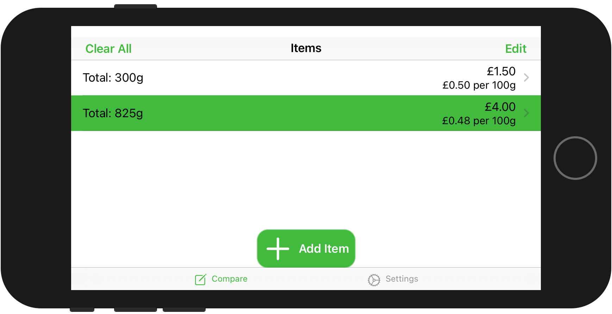

# Item Compare App
Support for the Item Compare App

## About the App
The item compare app was created out of a need to quickly compare two products of different sizes.  It works by helping you calculate the unit cost of each of the products and showing you the cheapest.

You can read more about this app on [Make Money, Save Money](https://makemoneysave.money/comparing-products/).

## Downloading Item Compare App
Download exclusively on the App Store.
 

## Support
The best way to get support for this app is with [Github issues](https://github.com/Make-Money-Save-Money/item-compare-app/issues).  You can search for existing problems or if you do not find your current issue then create it.
